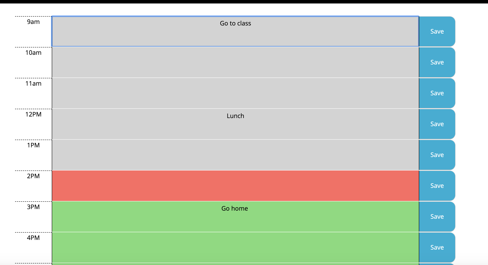
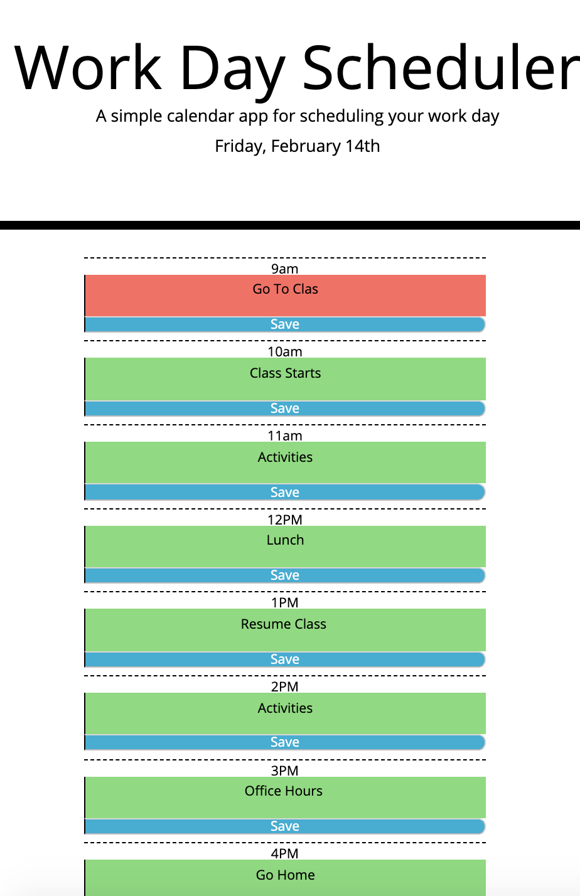

# DailyPlanner
In This activity I used a combination of HTML, with bootstrap, CSS, Javascript and JQuery to build a  responsive Daily Planner Application that allows you to store notes in each hour block from 9am to 5 pm. Through the use of local storage your stored notes will be saved through a refresh. The hours are also color coded by past present and future
https://cfech.github.io/DailyPlanner/

